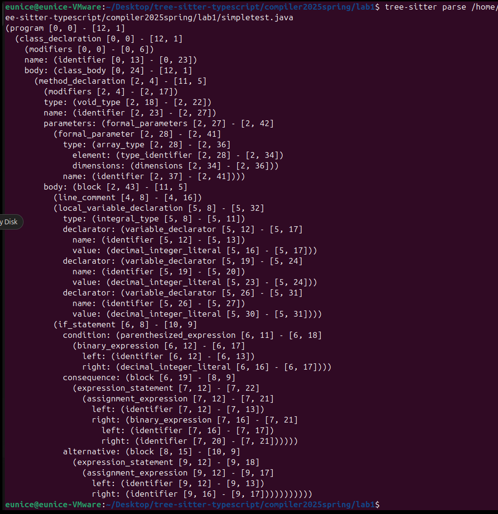
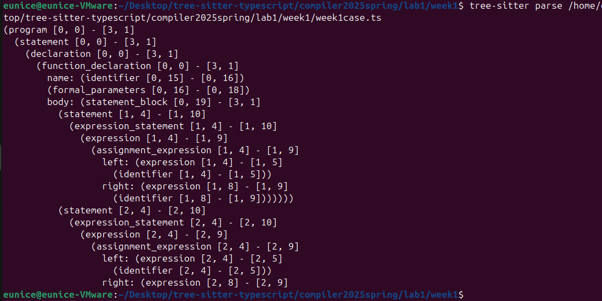

# <center>Lab1</center>
<center>王宁森 周子轩</center>
<center>22307130058 22307130401</center>

## 环境配置中遇到的问题

- 主要遇到的问题是在利用`ubuntu 22.04`直接使用`apt`安装`nodejs`得到的12.22.9版本过低，因此我手动利用`nodesource`添加了`nodejs` 18.20.6并进行了安装。

- `tree-sitter generate`指令默认编译`grammar.js`文件，若所提供的`grammar`文件名称不是`grammar.js`，则需要将其重命名为`grammar.js`，否则无法被编译。

## 运行输出截图

`simpletest.java`:



<div style="page-break-after: always;"></div>

`week1case.ts`:



## simpletest.java抽象语法树解析

`simpletest.java`源代码：

```java
public class SimpleTest {

    public static void main(String[] args) {

        //分支
        int a = 1, b = 2, c = 3;
        if (x > 0) {
            x = a + b;
        } else {
            x = a;
        }
    }
}
```

`tree-sitter`生成的抽象语法树：

```bash
(program [0, 0] - [12, 1]
  (class_declaration [0, 0] - [12, 1]
    (modifiers [0, 0] - [0, 6])
    name: (identifier [0, 13] - [0, 23])
    body: (class_body [0, 24] - [12, 1]
      (method_declaration [2, 4] - [11, 5]
        (modifiers [2, 4] - [2, 17])
        type: (void_type [2, 18] - [2, 22])
        name: (identifier [2, 23] - [2, 27])
        parameters: (formal_parameters [2, 27] - [2, 42]
          (formal_parameter [2, 28] - [2, 41]
            type: (array_type [2, 28] - [2, 36]
              element: (type_identifier [2, 28] - [2, 34])
              dimensions: (dimensions [2, 34] - [2, 36]))
            name: (identifier [2, 37] - [2, 41])))
        body: (block [2, 43] - [11, 5]
          (line_comment [4, 8] - [4, 16])
          (local_variable_declaration [5, 8] - [5, 32]
            type: (integral_type [5, 8] - [5, 11])
            declarator: (variable_declarator [5, 12] - [5, 17]
              name: (identifier [5, 12] - [5, 13])
              value: (decimal_integer_literal [5, 16] - [5, 17]))
            declarator: (variable_declarator [5, 19] - [5, 24]
              name: (identifier [5, 19] - [5, 20])
              value: (decimal_integer_literal [5, 23] - [5, 24]))
            declarator: (variable_declarator [5, 26] - [5, 31]
              name: (identifier [5, 26] - [5, 27])
              value: (decimal_integer_literal [5, 30] - [5, 31])))
          (if_statement [6, 8] - [10, 9]
            condition: (parenthesized_expression [6, 11] - [6, 18]
              (binary_expression [6, 12] - [6, 17]
                left: (identifier [6, 12] - [6, 13])
                right: (decimal_integer_literal [6, 16] - [6, 17])))
            consequence: (block [6, 19] - [8, 9]
              (expression_statement [7, 12] - [7, 22]
                (assignment_expression [7, 12] - [7, 21]
                  left: (identifier [7, 12] - [7, 13])
                  right: (binary_expression [7, 16] - [7, 21]
                    left: (identifier [7, 16] - [7, 17])
                    right: (identifier [7, 20] - [7, 21])))))
            alternative: (block [8, 15] - [10, 9]
              (expression_statement [9, 12] - [9, 18]
                (assignment_expression [9, 12] - [9, 17]
                  left: (identifier [9, 12] - [9, 13])
                  right: (identifier [9, 16] - [9, 17]))))))))))
```

分析：

```bash
(program [0, 0] - [12, 1]

...

)
```

以上为根节点 (`program`)：整个文件被解析为一个程序节点，从文件开头 (第0行第0列) 到文件结束 (第12行第1列)。

根节点内部：

```bash
    (class_declaration [0, 0] - [12, 1]
        (modifiers [0, 0] - [0, 6])
        name: (identifier [0, 13] - [0, 23])
        body: (class_body [0, 24] - [12, 1]
    ...
        )
    )
```

类声明 (`class_declaration`)表示整个 `SimpleTest` 类的声明。它包括：
- `modifiers [0, 0] - [0, 6]`：修饰符部分（这里是 `public`）。
- `name: (identifier [0, 13] - [0, 23])`：类名 `SimpleTest`。
- `body: (class_body [0, 24] - [12, 1])`：类体，包含类中的成员，在这里就是内部的`main`方法。

类体内部：

```bash
      (method_declaration [2, 4] - [11, 5]
        (modifiers [2, 4] - [2, 17])
        type: (void_type [2, 18] - [2, 22])
        name: (identifier [2, 23] - [2, 27])
        parameters: (formal_parameters [2, 27] - [2, 42]
          (formal_parameter [2, 28] - [2, 41]
            type: (array_type [2, 28] - [2, 36]
              element: (type_identifier [2, 28] - [2, 34])
              dimensions: (dimensions [2, 34] - [2, 36]))
            name: (identifier [2, 37] - [2, 41])))
        body: (block [2, 43] - [11, 5]

        ...  

        ))
```

方法声明(`method_declaration [2, 4] - [11, 5]`)
对应 `main` 方法的声明，包含以下部分：

- `modifiers [2, 4] - [2, 17]`：方法的修饰符，这里是`public static`。
- `type: (void_type [2, 18] - [2, 22])`：返回类型 `void`。
- `name: (identifier [2, 23] - [2, 27])`：方法名 `main`。
- `parameters: (formal_parameters [2, 27] - [2, 42])`：方法的参数部分，这里只有一个参数。参数由两部分组成：
    - `type: (array_type [2, 28] - [2, 36])`表示参数类型为数组，进一步细分为：
        - `element: (type_identifier [2, 28] - [2, 34])`：元素类型，这里是 `String`。
        - `dimensions: (dimensions [2, 34] - [2, 36])`：数组的维度标识 []。
        - `name: (identifier [2, 37] - [2, 41])`为参数名，即 `args`。
- `body: (block [2, 43] - [11, 5])`方法体。

方法体内部：

```bash
          (line_comment [4, 8] - [4, 16])
```
行内注释节点。

```bash
          (local_variable_declaration [5, 8] - [5, 32]
            type: (integral_type [5, 8] - [5, 11])
            declarator: (variable_declarator [5, 12] - [5, 17]
              name: (identifier [5, 12] - [5, 13])
              value: (decimal_integer_literal [5, 16] - [5, 17]))
            declarator: (variable_declarator [5, 19] - [5, 24]
              name: (identifier [5, 19] - [5, 20])
              value: (decimal_integer_literal [5, 23] - [5, 24]))
            declarator: (variable_declarator [5, 26] - [5, 31]
              name: (identifier [5, 26] - [5, 27])
              value: (decimal_integer_literal [5, 30] - [5, 31])))
```

局部变量声明：`(local_variable_declaration [5, 8] - [5, 32])`
声明了局部变量 `a`、`b` 和 `c`：
- `type: (integral_type [5, 8] - [5, 11])`：整型 `int`。
- 三个 `variable_declarator`：变量`a`，`b`，`c`，依次初始化为1，2，3。

```bash
          (if_statement [6, 8] - [10, 9]
            condition: (parenthesized_expression [6, 11] - [6, 18]
              (binary_expression [6, 12] - [6, 17]
                left: (identifier [6, 12] - [6, 13])
                right: (decimal_integer_literal [6, 16] - [6, 17])))
            consequence: (block [6, 19] - [8, 9]
              (expression_statement [7, 12] - [7, 22]
                (assignment_expression [7, 12] - [7, 21]
                  left: (identifier [7, 12] - [7, 13])
                  right: (binary_expression [7, 16] - [7, 21]
                    left: (identifier [7, 16] - [7, 17])
                    right: (identifier [7, 20] - [7, 21])))))
            alternative: (block [8, 15] - [10, 9]
              (expression_statement [9, 12] - [9, 18]
                (assignment_expression [9, 12] - [9, 17]
                  left: (identifier [9, 12] - [9, 13])
                  right: (identifier [9, 16] - [9, 17])))))
```

`if` 语句`(if_statement [6, 8] - [10, 9])`
表示 `if` 分支结构，包含条件`condition`、主分支`consequence`和可选的 `else` 分支`alternative`：

- 条件部分 `(condition)`:

  - `(parenthesized_expression [6, 11] - [6, 18])`表示条件表达式被圆括号包围，其内部为：
    - `(binary_expression [6, 12] - [6, 17])`是一个二元表达式，其中：
      - `left: (identifier [6, 12] - [6, 13])`：标识符 `x`。
      - `right: (decimal_integer_literal [6, 16] - [6, 17])`：整型字面量 0。
      - 整个表达式表示 `x > 0`，虽然树中没有显示运算符，但它已经被识别为一个二元表达式。
- 主分支 `(consequence)`:

  - `(block [6, 19] - [8, 9])`表示 `if` 条件为真时执行的代码块：
    - 包含一个表达式语句`(expression_statement [7, 12] - [7, 22])`，内部的赋值表达式：
      - `(assignment_expression [7, 12] - [7, 21])`将变量 `x` 赋值为 `a + b`：
        - 左侧：`(identifier [7, 12] - [7, 13])`为`x`；
        - 右侧：`(binary_expression [7, 16] - [7, 21])`为 `a + b`：
            - `left`: `(identifier [7, 16] - [7, 17])` 是 `a`；
            - `right`: `(identifier [7, 20] - [7, 21])` 是 `b`。
- `else` 分支 `(alternative)`:

  - `(block [8, 15] - [10, 9])`表示当`if`条件为假时执行的代码块：
    - 同样包含一个表达式语句：`(expression_statement [9, 12] - [9, 18])`，内部为赋值表达式：
      - `(assignment_expression [9, 12] - [9, 17])`将 `x` 赋值为 `a`：
        - 左侧：`(identifier [9, 12] - [9, 13])` 为 `x`；
        - 右侧：`(identifier [9, 16] - [9, 17])` 为 `a`。


## week1case.ts抽象语法树解析

`week1case.td`源代码：

```ts
// 单个函数
async function a() { 
    // 两条赋值表达式
    x = b;
    x = c;
}
```

`tree-sitter`生成的抽象语法树：

```bash
(program [0, 0] - [3, 1]
  (statement [0, 0] - [3, 1]
    (declaration [0, 0] - [3, 1]
      (function_declaration [0, 0] - [3, 1]
        name: (identifier [0, 15] - [0, 16])
        (formal_parameters [0, 16] - [0, 18])
        body: (statement_block [0, 19] - [3, 1]
          (statement [1, 4] - [1, 10]
            (expression_statement [1, 4] - [1, 10]
              (expression [1, 4] - [1, 9]
                (assignment_expression [1, 4] - [1, 9]
                  left: (expression [1, 4] - [1, 5]
                    (identifier [1, 4] - [1, 5]))
                  right: (expression [1, 8] - [1, 9]
                    (identifier [1, 8] - [1, 9]))))))
          (statement [2, 4] - [2, 10]
            (expression_statement [2, 4] - [2, 10]
              (expression [2, 4] - [2, 9]
                (assignment_expression [2, 4] - [2, 9]
                  left: (expression [2, 4] - [2, 5]
                    (identifier [2, 4] - [2, 5]))
                  right: (expression [2, 8] - [2, 9]
                    (identifier [2, 8] - [2, 9])))))))))))
```

分析：  

```bash
(program [0, 0] - [3, 1]
  (statement [0, 0] - [3, 1]
    (declaration [0, 0] - [3, 1]
    ...
```
这里有三个节点，分别为`program`、`statement`和`declaration`节点。`program`节点表示整个程序，其中包含一个表示程序中一条语句的`statement`节点；`statement`节点包含一个`declaration`节点，表明一个声明语句。这三层节点的范围都是`[0, 0] - [3, 1]`，因为这个代码只有一个函数。  

```bash
...
      (function_declaration [0, 0] - [3, 1]
        name: (identifier [0, 15] - [0, 16])
        (formal_parameters [0, 16] - [0, 18])
        body: (statement_block [0, 19] - [3, 1]
        ...
```
`function_declaration`节点表示一个函数的声明，包含三个部分：`name`函数名（此处为`a`）、`formal_parameters`函数的参数（此处为空列表，该函数无参数）和`body`函数体。  

```bash
...
        body: (statement_block [0, 19] - [3, 1]
          (statement [1, 4] - [1, 10]
            (expression_statement [1, 4] - [1, 10]
              (expression [1, 4] - [1, 9]
                (assignment_expression [1, 4] - [1, 9]
                  left: (expression [1, 4] - [1, 5]
                    (identifier [1, 4] - [1, 5]))
                  right: (expression [1, 8] - [1, 9]
                    (identifier [1, 8] - [1, 9]))))))
          ...
```
`body`里是函数的主体部分。该函数共有两行指令，`x = b`和`x = c`。上述语法树片段对应第一行指令`x = b`，这个`statement`的范围为`[1, 4] - [1, 10]`。这个指令是一个`assignment_expression`，即赋值表达式。该赋值表达式等号左侧和右侧内容分别由`left`和`right`给出，其中的`identifier`分别表示`x`和`b`。  

```bash
...
        body: (statement_block [0, 19] - [3, 1]
        ...
          (statement [2, 4] - [2, 10]
            (expression_statement [2, 4] - [2, 10]
              (expression [2, 4] - [2, 9]
                (assignment_expression [2, 4] - [2, 9]
                  left: (expression [2, 4] - [2, 5]
                    (identifier [2, 4] - [2, 5]))
                  right: (expression [2, 8] - [2, 9]
                    (identifier [2, 8] - [2, 9])))))))))))
```
该部分与上一部分类似，表示赋值表达式`x = c`，此处不赘述。  


