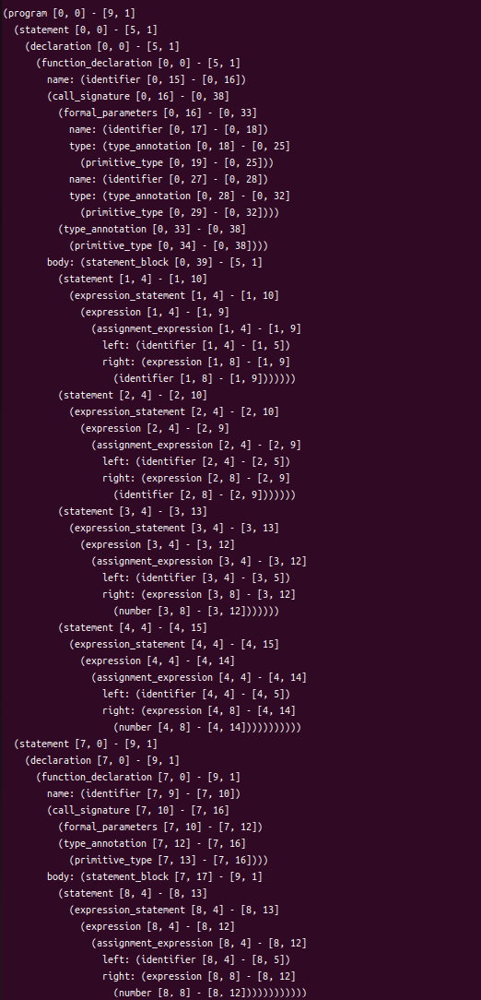

# <center>Lab1 Week2</center>
<center>王宁森 周子轩</center>
<center>22307130058 22307130401</center>

## 截图与输出



```bash
(program [0, 0] - [9, 1]
  (statement [0, 0] - [5, 1]
    (declaration [0, 0] - [5, 1]
      (function_declaration [0, 0] - [5, 1]
        name: (identifier [0, 15] - [0, 16])
        (call_signature [0, 16] - [0, 38]
          (formal_parameters [0, 16] - [0, 33]
            name: (identifier [0, 17] - [0, 18])
            type: (type_annotation [0, 18] - [0, 25]
              (primitive_type [0, 19] - [0, 25]))
            name: (identifier [0, 27] - [0, 28])
            type: (type_annotation [0, 28] - [0, 32]
              (primitive_type [0, 29] - [0, 32])))
          (type_annotation [0, 33] - [0, 38]
            (primitive_type [0, 34] - [0, 38])))
        body: (statement_block [0, 39] - [5, 1]
          (statement [1, 4] - [1, 10]
            (expression_statement [1, 4] - [1, 10]
              (expression [1, 4] - [1, 9]
                (assignment_expression [1, 4] - [1, 9]
                  left: (identifier [1, 4] - [1, 5])
                  right: (expression [1, 8] - [1, 9]
                    (identifier [1, 8] - [1, 9]))))))
          (statement [2, 4] - [2, 10]
            (expression_statement [2, 4] - [2, 10]
              (expression [2, 4] - [2, 9]
                (assignment_expression [2, 4] - [2, 9]
                  left: (identifier [2, 4] - [2, 5])
                  right: (expression [2, 8] - [2, 9]
                    (identifier [2, 8] - [2, 9]))))))
          (statement [3, 4] - [3, 13]
            (expression_statement [3, 4] - [3, 13]
              (expression [3, 4] - [3, 12]
                (assignment_expression [3, 4] - [3, 12]
                  left: (identifier [3, 4] - [3, 5])
                  right: (expression [3, 8] - [3, 12]
                    (number [3, 8] - [3, 12]))))))
          (statement [4, 4] - [4, 15]
            (expression_statement [4, 4] - [4, 15]
              (expression [4, 4] - [4, 14]
                (assignment_expression [4, 4] - [4, 14]
                  left: (identifier [4, 4] - [4, 5])
                  right: (expression [4, 8] - [4, 14]
                    (number [4, 8] - [4, 14]))))))))))
  (statement [7, 0] - [9, 1]
    (declaration [7, 0] - [9, 1]
      (function_declaration [7, 0] - [9, 1]
        name: (identifier [7, 9] - [7, 10])
        (call_signature [7, 10] - [7, 16]
          (formal_parameters [7, 10] - [7, 12])
          (type_annotation [7, 12] - [7, 16]
            (primitive_type [7, 13] - [7, 16])))
        body: (statement_block [7, 17] - [9, 1]
          (statement [8, 4] - [8, 13]
            (expression_statement [8, 4] - [8, 13]
              (expression [8, 4] - [8, 12]
                (assignment_expression [8, 4] - [8, 12]
                  left: (identifier [8, 4] - [8, 5])
                  right: (expression [8, 8] - [8, 12]
                    (number [8, 8] - [8, 12])))))))))))


```

## 16进制与10进制无符号整数的正则表达式

```javascript
          //week2任务，16进制数的正则表达式
          const hex_literal = /0[xX][0-9a-fA-F]+/;

          //week2任务，10进制数的正则表达式
          const decimal_digits = /[0-9]+/;
```

这一部分较为简单。

- 对于16进制无符号整数的正则表达式，`0[xX]`为16进制数必须的前导，此后可以为任意长度大于等于一的由`0-9`，`a-f`，`A-f`组成的序列。
- 对于10进制无符号整数的正则表达式，直接就是任意长度大于等于一的由`0-9`组成的序列。

### 遇到的问题

- 前导零的问题。最初尝试写正则表达式时考虑过含有前导零在`TypeScript`中是否合法的问题，经过查阅资料发现至少在`JavaScript`中前导零是合法的。参考资料为[字面量](https://developer.mozilla.org/zh-CN/docs/Web/JavaScript/Reference/Lexical_grammar#%E5%AD%97%E9%9D%A2%E9%87%8F)。
  - 不过在`ECMAScript 5`规范以前，如果一个十进制字面量以前导零开始，那么它就会被当作八进制数解析。相应的，在这些规范下，如果后续数字大于等于8，则会产生报错（参见这个[bug](https://bugzilla.mozilla.org/show_bug.cgi?id=957513)）。
- 下划线的问题。查阅前述资料[字面量](https://developer.mozilla.org/zh-CN/docs/Web/JavaScript/Reference/Lexical_grammar#%E5%AD%97%E9%9D%A2%E9%87%8F)时发现数字中允许使用数值分隔符`_`，来便于阅读。`_`不允许在数字开头出现、不允许再数字结尾出现、不允许连续出现。问过助教后，助教表示不用考虑这么复杂，但是我们还是尝试给出了正则表达式：

```javascript
          const hex_literal = /0[xX][0-9a-fA-F]+(_[0-9a-fA-F]+)*/;
          const decimal_digits = /[0-9]+(_[0-9]+)*/;
```
- 这里，第一个正闭包操作保证了至少有一个数字存在，并且保证下划线不会出现在数字最前面；后面的`(_[0-9]+)*`和`(_[0-9a-fA-F]+)*`保证了下划线不会出现在最后，并且下划线不会连续重复出现。


## 函数的参数解析与返回类型  

1. 参数解析  

```javascript
formal_parameters: $ => seq( // seq()表示按顺序匹配多个元素
    '(', // 匹配左括号
    commaSep(seq(
        field('name', $.identifier),
        field('type', optional($.type_annotation))
    )),
    ')', // 匹配右括号
),
```  
参数解析的对象是函数定义中声明的参数列表，定义函数接收的输入参数及其类型。匹配的顺序依次为左括号`(`、参数列表和右括号`)`。在该任务中左右括号的匹配已经给出。  

根据提示，用`commaSep()`函数来匹配零个或多个由逗号分隔的元素，里面嵌套使用`seq()`函数来顺序匹配具体元素。  

- `field('name', $.identifier)`：`field('name', ...)`用于识别参数的名称，而参数名称规定为`identifier`，这是引用其他已被定义的语法规则，在此处`identifier`被定义为`/[_a-zA-Z][_a-zA-Z0-9]*/`，测试代码中的变量名`b`和`c`就是有它来匹配。  

- `field('type', optional($.type_annotation))`：`field('type', ...)`用于识别参数的类型，`optional()`表示该部分是可选的，可存在也可不存在。函数的参数列表必须有变量名，但是`TypeScript`允许不规定参数的类型，此时会被隐式推断为`: any`，因此类型的注解为`optional`。此处引用名为`type_annotation`的规则，该规则已被定义包含`: number`和`: any`，冒号的匹配也被包含在其中。  

由于`commaSep()`函数可以匹配零个元素，因此当参数为空时也可以正确匹配。  

2. 函数调用签名  

```javascript
call_signature: $ => seq(
    //week2任务，函数的调用签名，包括参数与返回类型 。匹配的内容为 (b:number, c:any):void
    $.formal_parameters,
    $.type_annotation, 
),
```  

`call_signature`用于定义函数的调用签名语法规则，包含函数的参数列表和返回类型。  

- `$.formal_parameters`部分对应上述参数解析的内容，定义了函数的参数列表。  

- `$.type_annotation`定义函数的返回类型为`type_annotation`（包含`: any`、`: number`和`: void`等），该返回类型是必需的。查阅资料后发现，`TypeScript`支持用竖线分隔符`|`联合标记来支持泛型，但是此处只考虑简单情况，不对这种复杂情况进行匹配。

### 遇到的问题  

对于`call_signature`返回类型究竟是否是`optional`存疑，在查阅相关资料后可知`TypeScript`必须规定`call_signature`返回类型。此外，发现函数返回类型可以用竖线分隔符`|`联合标记来支持泛型，但简单起见此次实验并没有实现该功能。参考资料为[TypeScript Handbook](https://www.typescriptlang.org/docs/handbook/2/functions.html)。