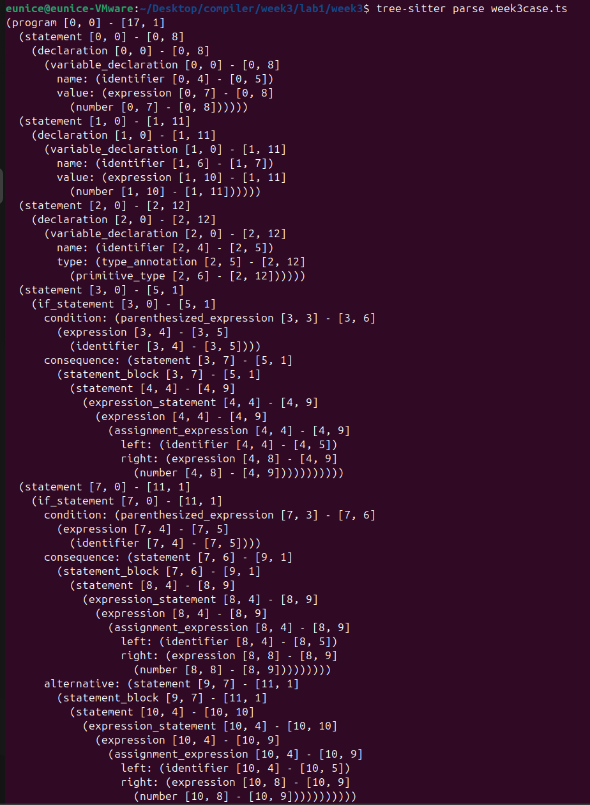
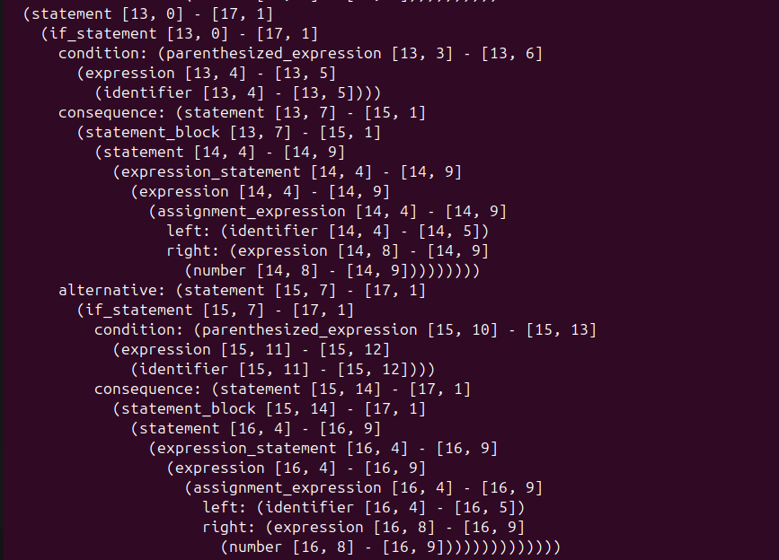

# <center>Lab1 Week3</center>
<center>王宁森 周子轩</center>
<center>22307130058 22307130401</center>

## 输出





```bash
(program [0, 0] - [17, 1]
  (statement [0, 0] - [0, 8]
    (declaration [0, 0] - [0, 8]
      (variable_declaration [0, 0] - [0, 8]
        name: (identifier [0, 4] - [0, 5])
        value: (expression [0, 7] - [0, 8]
          (number [0, 7] - [0, 8])))))
  (statement [1, 0] - [1, 11]
    (declaration [1, 0] - [1, 11]
      (variable_declaration [1, 0] - [1, 11]
        name: (identifier [1, 6] - [1, 7])
        value: (expression [1, 10] - [1, 11]
          (number [1, 10] - [1, 11])))))
  (statement [2, 0] - [2, 12]
    (declaration [2, 0] - [2, 12]
      (variable_declaration [2, 0] - [2, 12]
        name: (identifier [2, 4] - [2, 5])
        type: (type_annotation [2, 5] - [2, 12]
          (primitive_type [2, 6] - [2, 12])))))
  (statement [3, 0] - [5, 1]
    (if_statement [3, 0] - [5, 1]
      condition: (parenthesized_expression [3, 3] - [3, 6]
        (expression [3, 4] - [3, 5]
          (identifier [3, 4] - [3, 5])))
      consequence: (statement [3, 7] - [5, 1]
        (statement_block [3, 7] - [5, 1]
          (statement [4, 4] - [4, 9]
            (expression_statement [4, 4] - [4, 9]
              (expression [4, 4] - [4, 9]
                (assignment_expression [4, 4] - [4, 9]
                  left: (identifier [4, 4] - [4, 5])
                  right: (expression [4, 8] - [4, 9]
                    (number [4, 8] - [4, 9]))))))))))
  (statement [7, 0] - [11, 1]
    (if_statement [7, 0] - [11, 1]
      condition: (parenthesized_expression [7, 3] - [7, 6]
        (expression [7, 4] - [7, 5]
          (identifier [7, 4] - [7, 5])))
      consequence: (statement [7, 6] - [9, 1]
        (statement_block [7, 6] - [9, 1]
          (statement [8, 4] - [8, 9]
            (expression_statement [8, 4] - [8, 9]
              (expression [8, 4] - [8, 9]
                (assignment_expression [8, 4] - [8, 9]
                  left: (identifier [8, 4] - [8, 5])
                  right: (expression [8, 8] - [8, 9]
                    (number [8, 8] - [8, 9]))))))))
      alternative: (statement [9, 7] - [11, 1]
        (statement_block [9, 7] - [11, 1]
          (statement [10, 4] - [10, 10]
            (expression_statement [10, 4] - [10, 10]
              (expression [10, 4] - [10, 9]
                (assignment_expression [10, 4] - [10, 9]
                  left: (identifier [10, 4] - [10, 5])
                  right: (expression [10, 8] - [10, 9]
                    (number [10, 8] - [10, 9]))))))))))
  (statement [13, 0] - [17, 1]
    (if_statement [13, 0] - [17, 1]
      condition: (parenthesized_expression [13, 3] - [13, 6]
        (expression [13, 4] - [13, 5]
          (identifier [13, 4] - [13, 5])))
      consequence: (statement [13, 7] - [15, 1]
        (statement_block [13, 7] - [15, 1]
          (statement [14, 4] - [14, 9]
            (expression_statement [14, 4] - [14, 9]
              (expression [14, 4] - [14, 9]
                (assignment_expression [14, 4] - [14, 9]
                  left: (identifier [14, 4] - [14, 5])
                  right: (expression [14, 8] - [14, 9]
                    (number [14, 8] - [14, 9]))))))))
      alternative: (statement [15, 7] - [17, 1]
        (if_statement [15, 7] - [17, 1]
          condition: (parenthesized_expression [15, 10] - [15, 13]
            (expression [15, 11] - [15, 12]
              (identifier [15, 11] - [15, 12])))
          consequence: (statement [15, 14] - [17, 1]
            (statement_block [15, 14] - [17, 1]
              (statement [16, 4] - [16, 9]
                (expression_statement [16, 4] - [16, 9]
                  (expression [16, 4] - [16, 9]
                    (assignment_expression [16, 4] - [16, 9]
                      left: (identifier [16, 4] - [16, 5])
                      right: (expression [16, 8] - [16, 9]
                        (number [16, 8] - [16, 9])))))))))))))

```

## if_statement语句

```javascript
        statement: $ => choice(
            $.declaration,
            $.statement_block,
            $.expression_statement,
            $.if_statement
        ),

        if_statement: $ => prec.right(seq(
            //week3 if语句
            'if',
            field('condition', $.parenthesized_expression),
            field('consequence', $.statement),
            optional(seq(
                'else',
                field('alternative', $.statement)
            ))
        )),
       
        parenthesized_expression: $ => seq(
            //week3 括号表达式,用于if_statement的条件部分
            
            '(',
            $.expression,
            ')'
            
        ),
```

在`if_statement`中，
- 最前部的`if`用于匹配必须存在的`if`。
- `field('condition', $.parenthesized_expression)`用于匹配`if`语句中必须存在的条件部分即括号表达式。
- `field('consequence', $.statement)`为`if`语句中必须存在的至少一个结果，这个结果可以是`statement`中的任何一种（这里我们去掉了`statement`中重复出现的`statement_block`）。
- `optional(seq('else', field('alternative', $.statement)))`这一段用于匹配`if`语句中可选的`else`或者`else if`这样的嵌套`if_statement`，这种情况下必然出现`else`，以及`statement`则是后面的内容。这里，如果是`statement`中的`declaration, statement_block, expression_statement`这三种之一则对应的是`else`语句， `if_statement`则对应的是嵌套进入的`if_statement`：`else if{}`语句。

在`parenthesized_expression`中，
- 直接用`'(', $.expression, ')'`进行括号表达式的匹配，两侧的括号为必须有的左右括号，中间为表达式`expression`。

## 变量声明

  

  

```javascript
variable_declaration: $ => choice(
    // const声明必须初始化
    seq(
        field('kind', 'const'),
        field('name', $.identifier), // 变量名
        optional(field('type', $.type_annotation)), // 可选的类型注解
        seq('=', field('value', $.expression)), // 初始化表达式是必须的
        optional($._semicolon)
    ),
    // let声明初始化表达式是可选的
    seq(
        field('kind', 'let'),
        field('name', $.identifier),
        optional(field('type', $.type_annotation)),
        optional(seq('=', field('value', $.expression))), // 初始化表达式是可选的
        optional($._semicolon)
    )
),
```  

在`variable_declaration`中，需要实现`let`和`const`的变量声明匹配。`const`关键字引导的声明必须在声明时给变量赋值，即必须包含初始化表达式；而`let`关键字引导的声明即可是带类型注解的也可以是带初始化表达式的。因此需要一个`choice`函数来对二者进行选择。  

- `field('kind', '...')`用于匹配变量声明的关键字。关键字有两种选择：`let`和`const`。变量声明的关键字通常存储在`kind`属性中，因此使用`field('kind', ...)`来标识。  

- 变量声明的关键字后紧跟着的是变量名，通过`field('name', $.identifier)`来匹配。与`week2`实验的函数参数名匹配类似，变量名由`identifier`来定义，并存储在`name`属性中。  

- `let`引导的变量声明需支持带初始化和带类型注解两种类型，其中类型注解由`optional(field('type', $.type_annotation))`来匹配，并存储在`type`属性中。合法的类型由`type_annotation`来定义，包括`:any`、`:number`等。注意到`type_annotation`的定义中已经包括了冒号，因此无需单独对冒号进行匹配。  

- 由`optional(seq('=', field('value', $.expression)))`匹配带初始化的变量声明。变量声明为一个`expression`，`expression`的定义中不包括等号，因此需要单独匹配等号。  

- `const`引导的变量类型必须初始化，在初始化前也可选择注明类型，因此`field('type', $.type_annotation)`的匹配是可选的，而`seq('=', field('value', $.expression))`的匹配是必须的。

- `TypeScript`允许在变量声明语句后有一个可选的分号。

值得注意的是，`let`引导的变量声明的类型注解和初始化表达式的匹配都是可选的，这是因为`TypeScript`允许`let`型声明同时先后带有类型注解和初始化表达式，例如`let a: number = 3`；同时也允许`let`后只声明变量名，不进行赋值或表明类型，例如`let a`。


## 遇到的问题  

- 在写变量声明部分时，一开始没有对`const`和`let`进行区分，对两者的选择是在匹配`field('kind', ...)`时进行。后来意识到`const`引导的声明必须在声明时赋值，即`seq('=', field('value', $.expression))`并非`optional`，因此将`choice`移到最外面，从最开始就对二者进行划分。