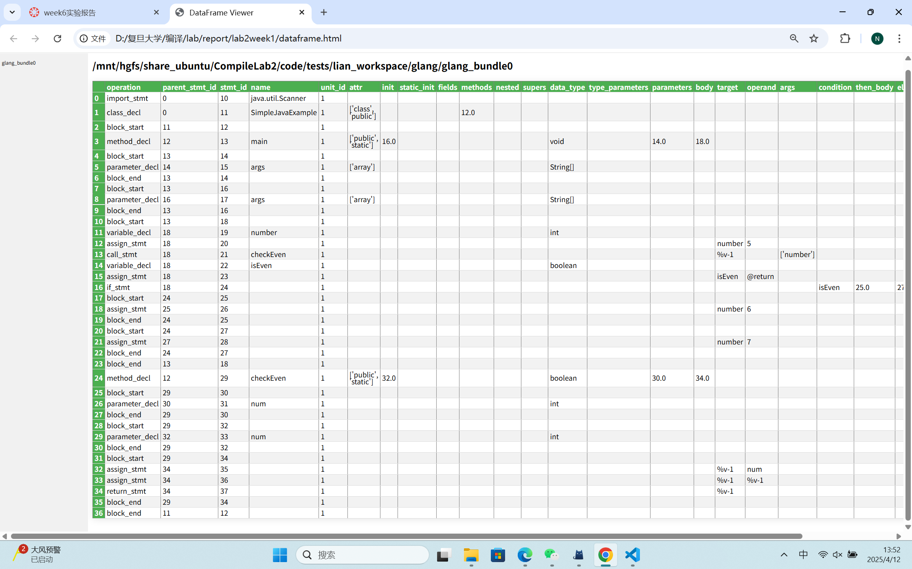

# <center>Lab2 Week1</center>
<center>王宁森 周子轩</center>
<center>22307130058 22307130401</center>

## 截图



## 解决本周任务与困难

一开始尝试直接不创建虚拟环境在全局环境中尝试配置遇到报错，于是果断安装`conda`在虚拟环境中尝试解决（看到需要指定`python`版本以及`pip`安装其实直觉就是要这么干）。装上`conda`并在虚拟环境中进行环境配置后很快就配置完成。

## 解析

源代码为：

```java
import java.util.Scanner;

public class SimpleJavaExample {
    
    // 主函数
    public static void main(String[] args) {

        int number = 5;
        
        // 函数调用
        boolean isEven = checkEven(number);
        
        // 分支语句
        if(isEven) {
            number = 6;
        } else {
            number = 7;
        }
        
    }
    
    // 检查数字是否为偶数的函数
    public static boolean checkEven(int num) {
        return num % 2 == 0;  // 返回布尔值
    }
    
}
```

绘制出简单的树状图作为示意：

```java
root    
├── import java.util.Scanner;
└── SimpleJavaExample
    ├── main(String[] args)
    │   ├── int number = 5
    │   ├── boolean isEven = checkEven(number)
    │   └── if (isEven)
    │       ├── number = 6
    │       └── else: number = 7
    └── checkEven(int num)
        └── return num % 2 == 0

```

- `import java.util.Scanner;`

|operation|parent_stmt_id|stmt_id|name|unit_id|...|
|-|-|-|-|-|-|
|import_stmt|0|10|java.util.Scanner|1||

这就是导入语句的节点。

- `public class SimpleJavaExample {...}`

|operation|parent_stmt_id|stmt_id|name|unit_id|attr|methods|...|
|-|-|-|-|-|-|-|-|
|class_decl|0|11|SimpleJavaExample|1|['class', 'public']|12.0|

这个是类声明结点，表明我们定义了一个名为 `SimpleJavaExample` 的公开类（属性为`class` `public`），父结点为根，对应方法结点在`stmt_id`为12。

紧接着的`stmt_id=12`的结点对应整个类后大括号的开始。

|operation|parent_stmt_id|stmt_id|name|unit_id|...|
|-|-|-|-|-|-|
|block_start|11|12||1||

最后的`stmt_id=30`的结点对应整个类后大括号的结束。

|operation|parent_stmt_id|stmt_id|name|unit_id|...|
|-|-|-|-|-|-|
|block_end|11|30||1||

它们的父结点都是类声明结点。

- `public static void main(String[] args){...}`

类声明内部的第一个方法。

|operation|parent_stmt_id|stmt_id|name|unit_id|attr|init|data_type|parameters|body|...|
|-|-|-|-|-|-|-|-|-|-|-|
|method_decl|12|13|main|1|['public', 'static']|16.0|void|14.0|18.0|

名为`main`方法的声明，`parameters = 14.0`表示对应参数定义在`stmt_id=14`，`body = 18.0`表示方法体从`stmt_id=18`开始。方法的属性为`public static`。返回类型为`void`。父结点为整个类体即`stmt=12`。

关于方法体则是下面这两部分：

|operation|parent_stmt_id|stmt_id|name|unit_id|...|
|-|-|-|-|-|-|
|block_start|13|18||1||


|operation|parent_stmt_id|stmt_id|name|unit_id|...|
|-|-|-|-|-|-|
|block_end|13|18||1||

他们的父结点都是`main`方法声明结点。

关于参数：

这里一开始没看懂，直接看GIR以为是两个参数，因为连着两个`parameter_decl`，后来发现其实不然。

参数：`String[] args`对应的GIR如下三行：

|operation|parent_stmt_id|stmt_id|name|unit_id|...|
|-|-|-|-|-|-|
|block_start|13|14||1||

|operation|parent_stmt_id|stmt_id|name|unit_id|attr|data_type|...|
|-|-|-|-|-|-|-|-|
|parameter_decl|14|15|args|1|['array']|'String[]'|

|operation|parent_stmt_id|stmt_id|name|unit_id|...|
|-|-|-|-|-|-|
|block_end|13|14||1||

但是诡异的是，我们看到了还有非常相似的三行：

|operation|parent_stmt_id|stmt_id|name|unit_id|...|
|-|-|-|-|-|-|
|block_start|13|16||1||

|operation|parent_stmt_id|stmt_id|name|unit_id|attr|data_type|...|
|-|-|-|-|-|-|-|-|
|parameter_decl|16|17|args|1|['array']|'String[]'|

|operation|parent_stmt_id|stmt_id|name|unit_id|...|
|-|-|-|-|-|-|
|block_end|13|16||1||

怎么想都不知道这里是在干啥。后来才发现，`main`方法还有个`init`字段，对应的就是`stmt_id=16`的结点，因此此处是参数的初始化部分。在方法真正开始执行之前，参数必须被赋予一个初始值（例如，运行时传入的命令行参数数组）。`GIR` 解析器采用了一个额外的块来表示这个初始化阶段，这里同样声明了`args`参数，但这是用来表示参数的初始状态，而不是重复的声明。

- `int number = 5`;

|operation|	stmt_id|	parent_stmt_id|	name|	data_type|
|-|-|-|-|-|
|variable_decl|	19|	18|	number|	int|


|operation|	stmt_id|	parent_stmt_id|	target|oprand|
|-|-|-|-|-|
assign_stmt|	20|	18|		number|5|

一个变量声明节点（`variable_decl`），用于描述变量的名称（`number`）和数据类型（`int`）；

一个赋值语句节点（`assign_stmt`），用于描述变量初始化时右侧表达式的求值及赋值操作。`target`字段`number`，`oprand`指明赋值语句的右侧是字面量5。


- `boolean isEven = checkEven(number);`

函数调用，并将返回值赋值给新声明的变量。

|operation|stmt_id|parent_stmt_id|name|target|args|
|-|-|-|-|-|-|
call_stmt|	21|	18|	checkEven|%v-1|number|

调用名为`checkEven`的函数，`target` 字段：
用`%v-1`进行存放。`args`字段：
参数列表中只有一个参数，即 `number`。

|operation|	stmt_id|	parent_stmt_id|	name|	data_type|
|-|-|-|-|-|
|variable_decl|	22|	18|	isEven|	boolen|

|operation|	stmt_id|	parent_stmt_id|	target|oprand|
|-|-|-|-|-|
assign_stmt|	23|	18|		isEven|@return|

类似前面的变量定义语句，这次是`boolen`类型的变量`isEven`被用调用函数的返回值进行赋值。


- `if(isEven) {number = 6;} else {number = 7;}`

|operation|parent_stmt_id|stmt_id|name|unit_id|condition|then_body|else_body|...|
|-|-|-|-|-|-|-|-|-|
|if_stmt|18|24||1|isEven|25.0|27.0||

`if`语句，条件为`isEven`，符合时为`stmt_id=25`，不符合时为`stmt_id=27`。

|operation|parent_stmt_id|stmt_id|unit_id|...|
|-|-|-|-|-|
|block_start|24|25|1||

|operation|	stmt_id|	parent_stmt_id|	target|oprand|
|-|-|-|-|-|
assign_stmt|	26|	25|		number|6|

|operation|parent_stmt_id|stmt_id|name|unit_id|...|
|-|-|-|-|-|-|
|block_end|24|25||1||

以上为符合时的代码块，内部是赋值语句，`number`赋值为字面量6；

|operation|parent_stmt_id|stmt_id|name|unit_id|...|
|-|-|-|-|-|-|
|block_start|24|27||1||

|operation|	stmt_id|	parent_stmt_id|	target|oprand|
|-|-|-|-|-|
assign_stmt|	28|	27|		number|7|

|operation|parent_stmt_id|stmt_id|name|unit_id|...|
|-|-|-|-|-|-|
|block_end|24|27||1||

以上为不符合时的代码块，内部是赋值语句，`number`赋值为字面7；

- `public static boolean checkEven(int num) {
        return num % 2 == 0;  // 返回布尔值
    }`

类内的第二个方法。

|operation|parent_stmt_id|stmt_id|name|unit_id|attr|init|data_type|parameters|body|...|
|-|-|-|-|-|-|-|-|-|-|-|
|method_decl|12|29|checkEven|1|['public', 'static']|32.0|boolen|30.0|34.0|

名为`checkEven`方法的声明，`parameters = 30.0`表示对应参数定义在`stmt_id=30`，`body = 34.0`表示方法体从`stmt_id=34`开始。方法的属性为`public static`。返回类型为`boolen`。父结点为整个类体即`stmt=12`。

参数：`int num`对应的GIR如下三行：

|operation|parent_stmt_id|stmt_id|name|unit_id|...|
|-|-|-|-|-|-|
|block_start|29|32||1||

|operation|parent_stmt_id|stmt_id|name|unit_id|attr|data_type|...|
|-|-|-|-|-|-|-|-|
|parameter_decl|14|15|num|1|'int'|

|operation|parent_stmt_id|stmt_id|name|unit_id|...|
|-|-|-|-|-|-|
|block_end|29|32||1||

下面类似地有一个参数的初始化。

函数体内只有一个语句，即`return num % 2 == 0;`

但是，它被拆分为多行：

首先计算`num % 2`，这个结果被保存在`%v-1`中；

|operation|	stmt_id|	parent_stmt_id|	target|oprand|operator|operand2|
|-|-|-|-|-|-|-|
assign_stmt|	35|	34|		%v-1|num|%|2|

接下来计算`%v-1 == 0`，计算结果也是保存在`%v-1`中，相当于更新了原有`%v-1`的值；

|operation|	stmt_id|	parent_stmt_id|	target|oprand|operator|operand2|
|-|-|-|-|-|-|-|
assign_stmt|	36|	34|		%v-1|%v-1|==|0|

最后，将`%v-1`返回。

|operation|	stmt_id|	parent_stmt_id|	target|
|-|-|-|-|
return_stmt|	37|	34|		%v-1|

如此便完成了整个的解析。

