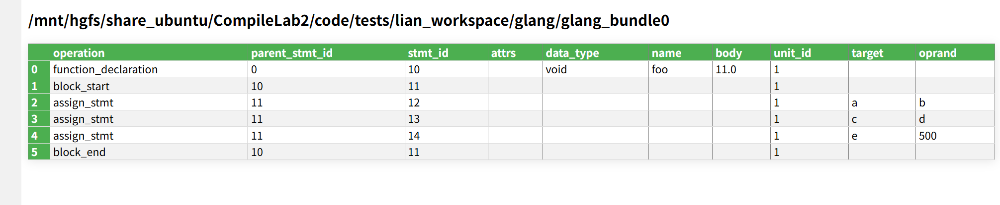

# <center>Lab2 Week2</center>
<center>王宁森 周子轩</center>
<center>22307130058 22307130401</center>

## 截图



## 遇到的困难

周子轩同学一开始未发现`code`文件夹中更新了`typescript`的`parser`文件夹，因此直接从头开始大写特写。最终及时发现并停止了这一行为。

## 函数声明

### 代码解析

```python
    def method_declaration(self, node: Node, statements: list):
        # 函数名
        name_node = node.child_by_field_name("name")
        fallback_name = f"<{node.type}_{node.start_byte}>"
        func_name = self.read_node_text(name_node) if name_node else fallback_name


        #修饰符 attrs (Modifiers)
        DIRECT_ATTR_KEYWORDS = {
            "public", "private", "protected",  # From accessibility_modifier choice
            "static", "abstract", "readonly",
            "async", "override",
            # 'get', 'set' could be added if needing to differentiate getters/setters
        }
        collected_attrs = set()

        for child in node.children:
            if child.is_named:
                if child.type in DIRECT_ATTR_KEYWORDS:
                    collected_attrs.add(child.type)

        parent = node.parent
        if parent:
            if parent.type == 'export_statement':
                collected_attrs.add('export')
                for child in parent.children:
                    if child.type == 'default':
                        collected_attrs.add('default')
            elif parent.type == 'ambient_declaration':
                 has_declare_keyword = False
                 for child in parent.children:
                     if child.type == 'declare':
                         has_declare_keyword = True
                         break
                 if has_declare_keyword:
                      collected_attrs.add('declare')

        attrs = sorted(list(collected_attrs)) if collected_attrs else None

        # 返回值类型 data_type
        data_type = None
        type_node = node.child_by_field_name("return_type")

        if type_node is not None:
            if type_node.type == 'type_annotation':
                actual_type_text_parts = []
                found_colon = False

                for child in type_node.children:
                    if not found_colon:
                        if self.read_node_text(child) == ':':
                            found_colon = True
                            continue
                    

                    if found_colon:
                        actual_type_text_parts.append(self.read_node_text(child))

                if actual_type_text_parts:
                    data_type = "".join(actual_type_text_parts).strip()
        
        # Ensure empty string becomes None
        if not data_type:
            data_type = None

        # 递归解析函数体 (Body)
        body_stmts: list = []
        body_node = node.child_by_field_name("body")
        if body_node is not None:
            if body_node.type == 'statement_block':
                 self.statement_block(body_node, body_stmts)
            elif node.type == 'arrow_function' and body_node.is_named:
                 expr_body_placeholder = { "expression_body": self.read_node_text(body_node) }
                 body_stmts.append(expr_body_placeholder)
        elif node.type in ('method_signature', 'function_signature'):
            pass

        # 组装 GIR 节点
        gir_key = node.type
        func_ir = {
            gir_key: {
                "attrs":      attrs,
                "data_type":  data_type,
                "name":       func_name,
                "body":       body_stmts,
             }
        }
        statements.append(func_ir)
        return func_name

```

定义了`method_declaration`方法，用于解析函数声明。  
两个参数：`node`和`statements`，其中`node`表示当前语法树的节点；`statements`是一个用来保存`GIR`解析结果的列表。  

对于函数名，通过 `node.child_by_field_name("name")` 提取节点中函数名字段。如果该字段存在，则使用其文本内容；否则，生成一个回退的函数名（`node_type_start_byte`）。这确保了即使没有明确的函数名，仍然能够生成一个唯一标识。

对于修饰符，考虑两种可能：
直接修饰符: 函数或方法的直接修饰符（如 `public`、`private`、`static`）通过遍历节点的子节点进行提取。如果一个子节点的类型属于修饰符，则将其加入 `collected_attrs` 集合。父节点上下文: 检查当前节点的父节点，识别是否属于 `export_statement` 或 `ambient_declaration`，并根据父节点的类型判断是否添加 `export`、`default` 或 `declare` 等属性。这里考虑的所有`attr`包括`public`, `private`, `protected`, `static`, `abstract`, `readonly`, `async`, `override`，直接取自`treesitter`生成`typescript`的`grammer.js`。

对于返回类型，
通过查找节点中的 `return_type` 字段来提取返回类型的`AST`子节点。如果找到了返回类型节点，则从节点中提取`type_annotation`获取具体类型，对于 `type_annotation` 这种包含 `: 类型` 结构的节点，会定位冒号并读取其后代表实际类型的所有子节点的文本，最终将其拼接并作为返回值类型字符串，若未找到类型节点或提取失败则返回 `None`。

对于函数体：
函数体`Body`通过查找 `body` 字段对应`AST`子节点来处理：如果`body`是一个 `statement_block`类型节点，则递归调用`self.statement_block`进行解析。对于箭头函数`arrow_function`，其体可能是一个表达式，此时需要将表达式作为占位符添加到`body_stmts`列表中。对于没有函数体的情况（`method_signature`, ` function_signature`），跳过处理。

最终，函数将解析得到的属性（`attrs`）、返回类型（`data_type`）、函数名（`func_name`）和函数体（`body_stmts`）组装成一个`GIR`节点，并将其添加到 `statements`列表中。`GIR`节点的键是当前节点的类型（如 `method_definition`），值为包含上述信息的字典。

### 结果分析

| operation    | parent_stmt_id | stmt_id | attrs | data_type | name | body | unit_id | target | operand |
|--------------|----------------|---------|-------|-----------|------|------|---------|--------|---------|
| function_declaration  | 0           | 10      | None  | void      | foo | 11.0 | None      | None     | None       |
|body_start|10|11|...|
|body_end|10|11|...|

符合最终的要求。

## 赋值表达式  

### 代码解析  

```python
    def assignment_expression(self, node: Node, statements: list):
        left_node  = node.child_by_field_name("left")  or node.named_children[0]
        right_node = node.child_by_field_name("right") or node.named_children[-1]

        # 只允许 identifier / literal
        if not (self.is_identifier(left_node) or self.is_literal(left_node)):
            return                          # 非简单左值：跳过
        if not (self.is_identifier(right_node) or self.is_literal(right_node)):
            return                          # 非简单右值：跳过

        target = self.read_node_text(left_node)
        value  = self.parse(right_node, statements)    # 调父类解析，保证字符串字面量等被处理

        # 生成中间表示
        stmt = {
            "assign_stmt": {
                "target": target,
                "oprand":  value,
            }
        }
        statements.append(stmt)
        return target     
```

定义了`assignment_expression`方法，用于解析赋值表达式。此处只需要考虑左右值为简单变量或常量即可，无需考虑表达式和数组等等。  
该方法接受两个参数：`node`和`statements`，其中`node`表示当前语法树的节点，代表一个赋值表达式；`statements`是一个用来保存`GIR`解析结果的列表。  
首先，获取赋值语句的左值与右值，分别存在`left_node`和`right_node`中，并验证左值与右值是否满足为标识符或字面量，若非简单值直接跳过。随后，获取目标`target`和值`oprand`，分别对应左值和右值的父类解析。最后，用得到的结果生成中间表示GIR，并返回左值。  

### 结果分析  

| operation    | parent_stmt_id | stmt_id | attrs | data_type | name | body | unit_id | target | operand |
|--------------|----------------|---------|-------|-----------|------|------|---------|--------|---------|
| assign_stmt  | 11             | 12      | None  | None      | None | None | 1       | a      | b       |
| assign_stmt  | 11             | 13      | None  | None      | None | None | 1       | c      | d       |
| assign_stmt  | 11             | 14      | None  | None      | None | None | 1       | e      | 500     |

三条赋值语句的父语句`ID`均为`11`，也即对应着这三条赋值语句来自同一个函数体内。三条语句的`ID`分别为`12`、`13`和`14`，由各自的`target`和`operand`值可知，这些语句对应如下形式：  

```typescript
    a = b
    c = d
    e = 500
```