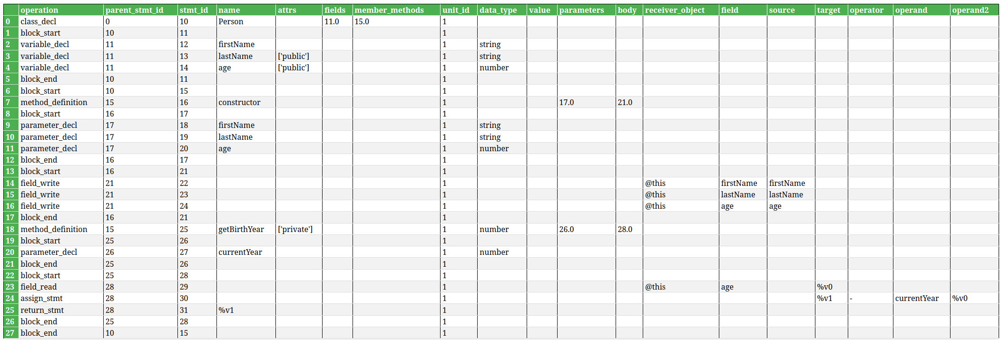

# <center>Lab2 Week3</center>
<center>王宁森 周子轩</center>
<center>22307130058 22307130401</center>

## 截图



## 解析class

## 完善assign_stmt

完善assign_stmt,使其支持左侧为object.property的情况，对应GIR指令为field_write

```python
def parse_field(self, node: Node, statements: list):
    myobject = self.find_child_by_field(node, "object")
    field = self.find_child_by_field(node, "property")
    shadow_object = self.parse(myobject, statements)
    shadow_field = self.parse(field, statements)
    return (shadow_object, shadow_field)

def assignment_expression(self, node: Node, statements: list):
        #week2任务
        #week3任务，需要支持left为object.property的形式，可以用parser_field函数帮助解析
        # week3任务: 支持 object.property 左值
        # Remove previous restrictive checks on left/right operands

        left_node = node.child_by_field_name("left")
        right_node = node.child_by_field_name("right")
        # operator_node = node.child_by_field_name("operator") # For compound assignment (optional)
        # op_text = self.read_node_text(operator_node) if operator_node else '='


        if not left_node or not right_node:
            # print(f"Warning: Skipping invalid assignment expression at {node.start_point}")
            return None # Or raise error

        # Parse the right side - the value being assigned
        value = self.parse(right_node, statements)

        # Check the type of the left side
        if left_node.type == "member_expression" or left_node.type == "subscript_expression":
            # Case: object.property = value OR object[property] = value
            # Use parse_field helper
            parsed_field_result = self.parse_field(left_node, statements)
            if parsed_field_result is None or parsed_field_result == (None, None):
                 # print(f"Warning: Could not parse field access in assignment LHS: {self.read_node_text(left_node)}")
                 return None # Failed to parse LHS field access

            shadow_object, shadow_field = parsed_field_result

            # Generate GIR for field write (simple assignment, ignore compound for now)
            stmt = {
                "field_write": {
                    "receiver_object": shadow_object,
                    "field": shadow_field,
                    "value": value,
                }
            }
            statements.append(stmt)
            # Assignment expressions usually evaluate to the assigned value
            return value

        elif self.is_identifier(left_node) or left_node.type == "private_property_identifier":
            # Case: variable = value
            target = self.read_node_text(left_node)

            # Generate GIR for variable assignment
            stmt = {
                "assign_stmt": {
                    "target": target,
                    "operand": value,
                }
            }
            statements.append(stmt)
            return value

        else:
            self.parse(left_node, statements)
            return value  
```

现在的`assignment_expression`方法在继承了上周处理简单变量（标识符）到简单值（标识符或字面量）赋值并生成 `assign_stmt` 指令的基础上，扩展了左值的支持范围,能够识别并处理`object.property`形式的赋值。通过判断左侧 `AST` 节点的类型 (`member_expression` 或 `subscript_expression`)，该方法会调用专门的辅助函数 `self.parse_field` 来解析出要操作的对象（`receiver_object`）和要访问的属性（`field`），并结合右侧表达式解析得到的 `value`，生成更具体的 `field_write` 中间表示指令，从而实现对对象属性或集合元素的赋值的 `GIR` 转换。

| operation    | parent_stmt_id | stmt_id | attrs | data_type | name | body | unit_id |reciever_object|field| target | operand |operator|operand2|
|--------------|----------------|---------|-------|-----------|------|------|---------|--------|---------|-|-|-|-|
| field_read  | 28             | 29      | None  | None      | None | None | 1       |@this|age| %v0      | None       | None |None|
| assign_stmt  | 28             | 30      | None  | None      | None | None | 1       |None|| %v1      | currentYear       |-|%v0|

`field_read`直接读取`this.age`并存入`%v0`，然后再计算`currentYear - this.age`并将结果存入`%v1`作为函数返回值。


## 完善method_definition

完善method_definition, 使其支持简单参数与类型，不要求支持可选参数、默认参数等复杂参数情况，
不要求支持复杂类型（联合类型、泛型等）

```python
    def method_declaration(self, node, statements):
        # week2任务
        # week3任务，需要支持参数，可以用formal_parameter函数帮助解析
        # 函数名
        # week2 & week3任务: 支持简单参数与类型
        name_node = node.child_by_field_name("name")
        fallback_name = f"<{node.type}_{node.start_byte}_{node.end_byte}>"
        func_name = self.read_node_text(name_node) if name_node else fallback_name
        if node.type == 'method_definition' and func_name == 'constructor':
            pass  # Keep 'constructor' name

        # 修饰符 attrs (Modifiers) - Use helper function
        attrs = self.parse_modifiers(node)  # Handles public/private etc. for methods
        # --- Parameter Parsing (Refined Loop) ---
        params_node = node.child_by_field_name("parameters")
        params_gir_list = []  # Use a distinct name for the list
        if params_node and params_node.type == 'formal_parameters':  # Check node type
            # Iterate through the actual parameter definition nodes inside formal_parameters
            # These children are typically 'required_parameter', 'optional_parameter', 'rest_parameter', etc.
            # Or sometimes just 'identifier' in simpler JS grammars.
            for param_node in params_node.named_children:
                # Directly call the dedicated formal_parameter function for each node
                parameter_info = self.formal_parameter(param_node, statements)  # Pass the actual parameter node
                if parameter_info:
                    # Append the dictionary returned by formal_parameter
                    params_gir_list.append(parameter_info)
                # else: # Optional: Log parameters that couldn't be parsed by formal_parameter
                #    print(f"Debug: formal_parameter returned None for node: {param_node.type}")

        # --- End Parameter Parsing ---

        # 返回值类型 data_type - Use helper function
        return_type_node = node.child_by_field_name("return_type")
        data_type = self.parse_type_annotation(return_type_node)

        # 递归解析函数体 (Body) - Keep existing logic
        body_stmts: list = []
        body_node = node.child_by_field_name("body")
        if body_node is not None:
            if body_node.type == 'statement_block':
                self.statement_block(body_node, body_stmts)  # Assumes statement_block exists
            # Handle arrow function expression body (non-block)
            elif node.type == 'arrow_function' and self.is_expression(body_node):
                result_expr = self.parse(body_node, body_stmts)
                # Add implicit return for arrow function expression body
                body_stmts.append({"return_stmt": {"value": result_expr}})  # Use 'value' key
            # Method/Function signatures/abstract methods have no body
            elif node.type in ('method_signature', 'function_signature', 'abstract_method_signature'):
                pass  # No body to parse

        # 组装 GIR 节点
        gir_key = node.type
        func_ir = {
            gir_key: {
                "attrs": attrs,
                "data_type": data_type,  # Return type
                "name": func_name,
                "parameters": params_gir_list,  # Include parsed parameters
                "body": body_stmts,
            }
        }
        statements.append(func_ir)
        return func_name

    def formal_parameter(self, node: Node, statements: list):
        """ Parses a single simple formal parameter (name and optional type). statements not used. """
        # week3任务，解析参数
        # Handles nodes like 'required_parameter' or just 'identifier' within 'formal_parameters'.

        param_name = None
        data_type = None
        name_node = None
        type_node = None

        # Find name and type nodes based on expected structures
        if node.type == 'required_parameter':
            # For required_parameter, the name is inside the 'pattern' field
            name_node = node.child_by_field_name("pattern")  # Often an identifier
            type_node = node.child_by_field_name("type")
        elif node.type == 'identifier':  # Simple JS-style parameter (name only)
            name_node = node
            type_node = None  # No type annotation possible here in standard JS
        elif node.type == 'this_parameter':  # Handle 'this' parameter in TS
            # Name is implicitly 'this'
            name_node = node.children[0] if node.children and node.children[0].type == 'this' else None
            type_node = node.child_by_field_name("type")  # Type follows 'this'
        # Add elif for 'optional_parameter' if needed later, extracting name/type similarly
        # else: print(f"Debug: Unhandled node type in formal_parameter: {node.type}")

        # Extract name text
        if name_node:
            # If pattern is identifier (common case)
            if name_node.type == 'identifier' or name_node.type == 'this':
                param_name = self.read_node_text(name_node)
            # Skip destructuring patterns as per requirements
            elif name_node.type in ('object_pattern', 'array_pattern'):
                # print(f"Skipping destructuring parameter: {self.read_node_text(name_node)}")
                return None  # Skip complex parameters
            else:  # Fallback if pattern is something else but contains text
                param_name = self.read_node_text(name_node)

        # Extract type using helper
        # Ensure type_node is sought correctly even if name_node wasn't 'required_parameter'
        if type_node is None and node.type != 'identifier':  # Check direct field if not found yet
            type_node = node.child_by_field_name("type")
        data_type = self.parse_type_annotation(type_node)

        # Return GIR dictionary for the parameter if name was found
        if param_name:
            return {
                "parameter_decl": {
                    "name": param_name,
                    "data_type": data_type,
                }

            }

        # print(f"Warning: Could not parse formal parameter node: {node.type} {self.read_node_text(node)}")
        return None  # Parameter couldn't be parsed

    def parse_type_annotation(self, type_node: Node):
        """ Parses a type annotation node and returns the type string. """
        if type_node and (type_node.type == 'type_annotation' or type_node.type == 'predefined_type'):
            actual_type_text_parts = []
            start_collecting = False
            if type_node.type == 'predefined_type':
                start_collecting = True  # Directly use the text of predefined_type
                actual_type_text_parts.append(self.read_node_text(type_node))
            else:
                # For type_annotation, skip the ':'
                for child in type_node.children:
                    if start_collecting:
                        actual_type_text_parts.append(self.read_node_text(child))
                    elif self.read_node_text(child) == ':':
                        start_collecting = True

            type_str = "".join(actual_type_text_parts).strip()
            return type_str if type_str else None
        elif type_node:  # Handle cases where type is directly given (e.g. in `as` cast)
            return self.read_node_text(type_node).strip()
        return None
```

在完成这种的任务之前，先把上周那个又臭又长的代码做了一些分解。

解析函数名 (`func_name`) 和修饰符 (`attrs`)用`self.parse_modifiers(node)` 这个辅助函数进行了封装。解析函数体 (`body_stmts`)，处理 `statement_block` 和箭头函数的表达式体时，对后者增加了隐式的 `return_stmt GIR`。对返回值类型的解析也进行了优化，拆分出 `self.parse_type_annotation(return_type_node)` 辅助函数来处理，替换了上周手动查找冒号后拼接文本的逻辑，这里就不去细讲了，实际上就是把上次的部分代码拆了出去。

下面是这种的参数解析：

参数解析 (新增核心功能):查找名为 `parameters` 的子节点，创建一个新的列表 `params_gir_list` 来收集解析后的参数 `GIR`。
遍历 `parameters_node` 的命名子节点 (`named_children`)。对于每一个独立的参数节点调用了新建的辅助方法 `self.formal_parameter(param_node, statements)` （下面会有讲解）来进行处理。`self.formal_parameter` 返回一个表示单个参数的 GIR 字典添加到 `params_gir_list` 中。

`formal_parameter` 方法：它接收一个表示单个参数的 `AST` 节点 
根据传入的参数节点的类型 ，查找参数的名称节点 (`name_node`) 和类型节点 (`type_node`)。然后提取参数名: 从 `name_node` 中读取文本作为 `param_name`。此过程中跳过复杂参数: 明确检查 `name_node` 是否是 `object_pattern` 或 `array_pattern`（解构赋值参数）。如果是，则直接返回 `None`。
最后调用 `self.parse_type_annotation(type_node)` 辅助方法来解析参数的类型注解。

