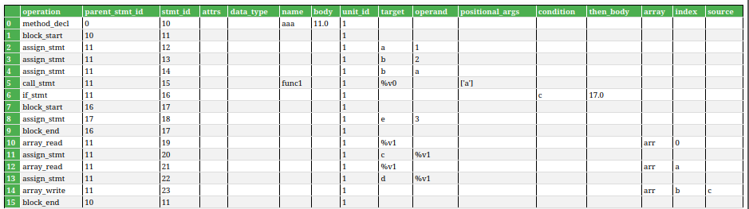
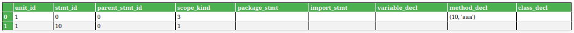
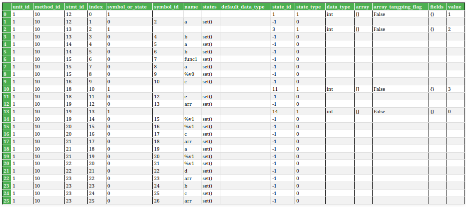

# <center>Lab2 Week3</center>
<center>王宁森 周子轩</center>
<center>22307130058 22307130401</center>

## 截图






## 解析`call_expression`

```python
    def call_stmt_def_use(self, stmt_id, stmt):
        # convert stmt.args(str) to list
        args_list = []
        positional_args = ast.literal_eval(stmt.positional_args)
        #lab3week1 work

        # The function name is used
        used_symbols = [stmt.name]

        # All positional arguments are used
        for arg in positional_args:
            if not util.isna(arg):
                used_symbols.append(arg)

        # If there's a target, it's defined
        defined_symbol = stmt.target

        self.add_def_use_symbols(
            stmt_id,
            def_symbol=defined_symbol,
            used_symbols=used_symbols,
            op=ComputeOperation.CALL
        )
```

`call_stmt`需要解析函数调用时发生的`def-use`，在这里`positional_args`存储有函数调用时的所有实参，有效实参和被调用函数本身`stmt.name`均为发生了`use`。在添加实参到`used_symbols`时会检查当前参数是否不是一个“不可用”（NA - Not Available）的值，如果不是则添加到`used_symbols`。如果函数调用时，函数返回值被赋值给了一个新的对象即`target`字段的内容，则`target`字段部分对应了`def`。

在我们的测试样例中涉及到`call_stmt_def_use`的为：

```typescript
func1(a)
```

它在GIR中的`stmt_id`为15。
|operation|stmt_id|name|target|positional_args|
|-|-|-|-|-|
|call_stmt|15|func1|%v0|['a']|

去找对应的`def-use`：
|stmt_id|defined_symbol|used_symbols|
|-------|--------------|------------|
|15     |8            |[6, 7]|

可以看到被`def`的`index`为8，`used`的`index`为6，7。

|stmt_id|index|name|
|-------|---------|----|
|15     |8        |%v0 |
|15     |6        |func1|
|15     |7        |a   |

对应地，在这里找到`index`为6，7，8的三行，可以看到函数`func1`被调用时，`used`的是这个函数本身`func1`和它的参数`a`，`def`的是中间变量`%v0`，这与我们解析得到的GIR保持一致。

## 解析`if_stmt`

```python
    def if_stmt_def_use(self, stmt_id, stmt):
        #lab3week1 work
        # Only the condition is used
        used_symbols = [stmt.condition]
        
        self.add_def_use_symbols(
            stmt_id,
            def_symbol=None,  # if statement doesn't define anything
            used_symbols=used_symbols,
            op=ComputeOperation.IF
        )
```

`if_stmt`就要简单很多，整个过程中只有条件变量`condition`字段部分是`used`，而`if_stmt`本身**不会定义任何内容**。

在测试中涉及`if_stmt`的是：

```typescript
    if (c){
        ...
    }
```

它在GIR中的`stmt_id`为16。
|operation|stmt_id|condition|
|-|-|-|
|if_stmt|16|c|

去找对应的`def-use`：
|stmt_id|defined_symbol|used_symbols|
|-------|--------------|------------|
|16     |-1            |[9]|

可以看到被`def`的`index`没有，`used`的`index`为9。

|stmt_id|index|name|
|-------|---------|----|
|16     |9        |c |


对应地，在这里找到`index`为9的，可以看到这个`if_stmt`只会涉及`use`条件变量`c`。


## 解析`array_wrirte`

```python
    def array_write_def_use(self, stmt_id, stmt):
        # The array variable, index, and value are used
        used_symbols = [stmt.array, stmt.index, stmt.source]
        
        # The array element is defined (array_name is both used and defined)
        defined_symbol = stmt.array
        
        self.add_def_use_symbols(
            stmt_id,
            def_symbol=defined_symbol,
            used_symbols=used_symbols,
            op=ComputeOperation.ARRAY_WRITE
        )
```

`array_write`需要解析数组写入时的`def-use`，在`array_write_def_use()`方法中完成。在写入数组时，例如语句`arr[b] = c`，被`define`的量是数组变量名`arr`，被`use`的量有数组变量名`arr`、数组索引`b`和写入的数据`c`。其中，数组变量名`arr`即被`define`也被`use`是因为`arr`既要用于提供计算内存地址的起始位置，其数组值也会被修改。
在上述代码实现中，`used_symbols = [stmt.array, stmt.index, stmt.source]`表示被使用的值有数组变量名`stmt.array`、数组索引`stmt.index`和右式中写入数组的值`stmt.source`。`defined_symbol = stmt.array`表示被定义的值是数组变量名`stmt.array`。

在“截图”中可以看到，上述例子`arr[b]=c`对应的`def-use`关系如下：

|stmt_id|defined_symbol|used_symbols|
|-------|--------------|------------|
|23     |25            |[22, 23, 24]|

|stmt_id|index|name|
|-------|---------|----|
|23     |22       |arr |
|23     |23       |b   |
|23     |24       |c   |
|23     |25       |arr |

可以看出，解析结果于之前的分析一致。

## 解析`array_read`

```python
    def array_read_def_use(self, stmt_id, stmt):
        # The array variable and index are used
        used_symbols = [stmt.array, stmt.index]
        
        # The target is defined
        defined_symbol = stmt.target
        
        self.add_def_use_symbols(
            stmt_id,
            def_symbol=defined_symbol,
            used_symbols=used_symbols,
            op=ComputeOperation.ARRAY_READ
        )
```

`array_read`需要解析数组读取的`def-use`，在`array_read_def_use()`方法中完成。在读取数组时，例如语句`d=arr[a]`，被`define`的量是`d`，被`use`的量有该数组的变量名`arr`和访问数组的索引`a`。在上述代码实现中，`defined_symbol = stmt.target`，即语句的左式`stmt.targrt`被定义；`used_symbols = [stmt.array, stmt.index]`，即数组变量名`stmt.array`和数组索引`stmt.index`被使用。

在“截图”中可以看到，上述例子`d=arr[a]`对应的`def-use`关系如下：

|stmt_id|defined_symbol|used_symbols|
|-------|--------------|------------|
|21     |19            |[17, 18]    |
|22     |21            |[20]        |

|stmt_id|index|name|
|-------|---------|----|
|21     |17       |arr |
|21     |18       |a   |
|21     |19       |%v2 |
|22     |20       |%v2 |
|22     |21       |d   |

在上表中，该赋值语句被拆解成两条语句，并由中间临时变量`%v2`存储读取的值，再赋给`d`。可以看出，解析结果于之前的分析一致。

## 遇到的问题

- 一开始在写`array_write_def_use`时，以为数组名只会被`define`不会被`use`，所以漏掉了一个使用值。后来对照给的参考答案和一些资料了解到数组名会同时被定义和使用。
- 在写`if_stmt_def_use`时产生了一个奇思妙想，想到C语言中可以这么写：

```c
#include <stdio.h>

bool isTrue(bool a){
    return a;
}

int main() {


    bool a = 1;
    if(bool condition = isTrue(a)){
        printf("Yes, it is legal to write a def in if statement for C.\n");
    }

    return 0;
}
```

也就是说在c语言中可以在`if_stmt`中进行`def`操作的。我开始担忧ts中是否也有类似做法。经过资料查阅后发现ts里严格限制了`if_stmt`中不可以进行变量声明，于是就不担心了。