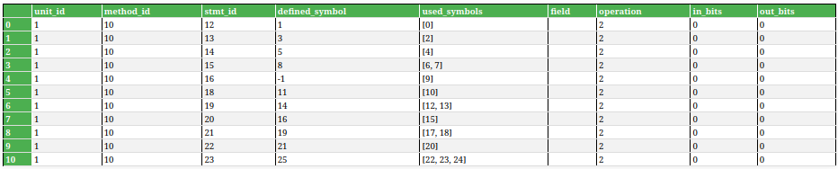

# <center>Lab2 Week3</center>
<center>王宁森 周子轩</center>
<center>22307130058 22307130401</center>

## 截图





## 解析`call_expression`

## 解析`if_stmt`

## 解析`array_wrirte`

```python
    def array_write_def_use(self, stmt_id, stmt):
        # The array variable, index, and value are used
        used_symbols = [stmt.array, stmt.index, stmt.source]
        
        # The array element is defined (array_name is both used and defined)
        defined_symbol = stmt.array
        
        self.add_def_use_symbols(
            stmt_id,
            def_symbol=defined_symbol,
            used_symbols=used_symbols,
            op=ComputeOperation.ARRAY_WRITE
        )
```

`array_write`需要解析数组写入时的`def-use`，在`array_write_def_use()`方法中完成。在写入数组时，例如语句`arr[b] = c`，被`define`的量是数组变量名`arr`，被`use`的量有数组变量名`arr`、数组索引`b`和写入的数据`c`。其中，数组变量名`arr`即被`define`也被`use`是因为`arr`既要用于提供计算内存地址的起始位置，其数组值也会被修改。
在上述代码实现中，`used_symbols = [stmt.array, stmt.index, stmt.source]`表示被使用的值有数组变量名`stmt.array`、数组索引`stmt.index`和右式中写入数组的值`stmt.source`。`defined_symbol = stmt.array`表示被定义的值是数组变量名`stmt.array`。

在“截图”中可以看到，上述例子`arr[b]=c`对应的`def-use`关系如下：

|stmt_id|defined_symbol|used_symbols|
|-------|--------------|------------|
|23     |25            |[22, 23, 24]|

|stmt_id|symbol_id|name|
|-------|---------|----|
|23     |23       |arr |
|23     |24       |b   |
|23     |25       |c   |
|23     |26       |arr |

可以看出，解析结果于之前的分析一致。

## 解析`array_read`

```python
    def array_read_def_use(self, stmt_id, stmt):
        # The array variable and index are used
        used_symbols = [stmt.array, stmt.index]
        
        # The target is defined
        defined_symbol = stmt.target
        
        self.add_def_use_symbols(
            stmt_id,
            def_symbol=defined_symbol,
            used_symbols=used_symbols,
            op=ComputeOperation.ARRAY_READ
        )
```

`array_read`需要解析数组读取的`def-use`，在`array_read_def_use()`方法中完成。在读取数组时，例如语句`d=arr[a]`，被`define`的量是`d`，被`use`的量有该数组的变量名`arr`和访问数组的索引`a`。在上述代码实现中，`defined_symbol = stmt.target`，即语句的左式`stmt.targrt`被定义；`used_symbols = [stmt.array, stmt.index]`，即数组变量名`stmt.array`和数组索引`stmt.index`被使用。

在“截图”中可以看到，上述例子`d=arr[a]`对应的`def-use`关系如下：

|stmt_id|defined_symbol|used_symbols|
|-------|--------------|------------|
|21     |19            |[17, 18]    |
|22     |21            |[20]        |

|stmt_id|symbol_id|name|
|-------|---------|----|
|21     |18       |arr |
|21     |19       |a   |
|21     |20       |%v2 |
|22     |21       |%v2 |
|22     |22       |d   |

在上表中，该赋值语句被拆解成两条语句，并由中间临时变量`%v2`存储读取的值，再赋给`d`。可以看出，解析结果于之前的分析一致。

## 遇到的问题

- 一开始在写`array_write_def_use`时，以为数组名只会被`define`不会被`use`，所以漏掉了一个使用值。后来对照给的参考答案和一些资料了解到数组名会同时被定义和使用。