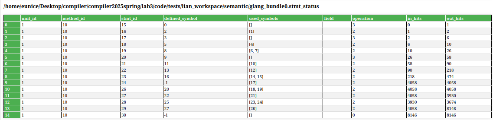
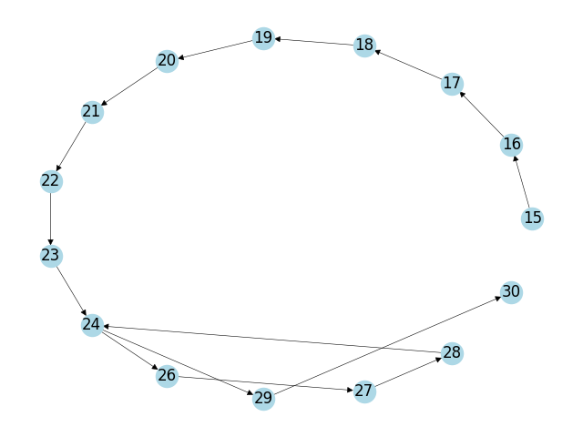

# <center>Lab3 Week2</center>
<center>王宁森 周子轩</center>
<center>22307130058 22307130401</center>

## 截图



## 补充完成reaching_symbol_analysis

```python
    @profile
    def reaching_symbol_analysis(self):
       
        worklist = list(self.stmt_to_status.keys())
        while len(worklist) != 0:
            stmt_id = worklist.pop(0)
            if stmt_id not in self.stmt_to_status:
                continue
            status = self.stmt_to_status[stmt_id]
            old_outs = status.out_bits

            status.in_bits = 0
            for parent_stmt_id in self.cfg.predecessors(stmt_id):
                if parent_stmt_id in self.stmt_to_status:
                    parent_out_bits = self.stmt_to_status[parent_stmt_id].out_bits
                    # TODO task1 根据cfg准备并设置status.in_bits
                    status.in_bits |= parent_out_bits

            status.out_bits = status.in_bits
            # if current stmt has def
            defined_symbol_index = status.defined_symbol
            if defined_symbol_index != -1:
                defined_symbol = self.symbol_state_space[defined_symbol_index]
                if isinstance(defined_symbol, Symbol):
                    # TODO task2 根据当前defined_symbol的all_def_stmts,通过self.bit_vector_manager,应用kill-gen算法对status.out_bits进行更新
                    all_def_stmts = self.symbol_to_def_stmts[defined_symbol.name]
                    # Kill phase
                    status.out_bits = self.bit_vector_manager.kill_stmts(status.out_bits, all_def_stmts)
                    # Gen phase (current statement)
                    status.out_bits = self.bit_vector_manager.gen_stmts(status.out_bits, [stmt_id])

            
            # TODO task3 通过判断out_bits是否变化来判断是否到达不动点 
            if status.out_bits != old_outs:
                worklist = util.merge_list(worklist, list(self.cfg.successors(stmt_id)))
```

关于`task1`根据`cfg`准备并设置`status.in_bits`：
```python
            status.in_bits = 0
            for parent_stmt_id in self.cfg.predecessors(stmt_id):
                if parent_stmt_id in self.stmt_to_status:
                    parent_out_bits = self.stmt_to_status[parent_stmt_id].out_bits
                    # TODO task1 根据cfg准备并设置status.in_bits
                    status.in_bits |= parent_out_bits
```

这里需要我们做的其实非常简单了，对于每个`parent_stmt_id`，它们的`out_bits`就是现在这个语句的`in_bits`，因此直接把`status.in_bits`和`parent_out_bits`做按位或操作即可。

关于`task2`根据当前`defined_symbol`的`all_def_stmts`,通过`self.bit_vector_manager`,应用`kill-gen`
算法对`status.out_bits`进行更新:
```python
            status.out_bits = status.in_bits
            # if current stmt has def
            defined_symbol_index = status.defined_symbol
            if defined_symbol_index != -1:
                defined_symbol = self.symbol_state_space[defined_symbol_index]
                if isinstance(defined_symbol, Symbol):
                    # TODO task2 根据当前defined_symbol的all_def_stmts,通过self.bit_vector_manager,应用kill-gen算法对status.out_bits进行更新
                    all_def_stmts = self.symbol_to_def_stmts[defined_symbol.name]
                    # Kill phase
                    status.out_bits = self.bit_vector_manager.kill_stmts(status.out_bits, all_def_stmts)
                    # Gen phase (current statement)
                    status.out_bits = self.bit_vector_manager.gen_stmts(status.out_bits, [stmt_id])
```

`kill-gen`算法是很符合直觉的，首先`defined_symbol = self.symbol_state_space[defined_symbol_index]` 通过在 `method_analysis` 中初始化和填充的 `self.symbol_state_space` 获取此处被`def`的符号对象；然后调用`kill`，将此时`out_bits`中可能与此处被`def`的符号对象重复的部分去掉，因为此处被新`def`的会导致原先旧的`def`不可用；最后再用`gen`把当前的新的可达`def`加上。

关于`task3`通过判断`out_bits`是否变化来判断是否到达不动点:

```python
            # TODO task3 通过判断out_bits是否变化来判断是否到达不动点 
            if status.out_bits != old_outs:
                worklist = util.merge_list(worklist, list(self.cfg.successors(stmt_id)))
```

如果当前`out_bits`与前一轮的`out_bits`有变化，就需要通知所有直接后继语句重新计算它们的`in_bits` 和 `out_bits`。这里利用在 `method_analysis` 中构建好的 `self.cfg` 获取当前语句的所有后继节点 `(self.cfg.successors(stmt_id))`，并将它们的 `ID` 添加到 `worklist` 中。否则说明到达了不动点，就可以不再加入后继节点了。

## 补充完成对bit_vector的操作

```python
    def kill_stmts(self, bit_vector, stmts):
    # TODO 实现kill,获取stmt对应的bit_pos，通过位操作更新bit_vector
        for stmt in stmts:
            # Get the bit position for this statement
            bit_pos = self.stmt_to_bit_pos.get(stmt)
            # Clear the bit at this position (using AND with NOT)
            bit_vector &= ~(1 << bit_pos)
        return bit_vector
```

`kill`操作需要遍历输入的语句列表也即要杀掉的对象`stmts`，对于其中每一个单独的语句`stmt`拿对应的`bit_pos`，表示它在位向量中对应的位位置；将`1`左移对应`bit_pos`位然后取反，这样在`1`的位置变为`0`，其余位置全部为`1`，这使得最后与整个`bit_vector`取与的时候使得`bit_pos`位置被置为`0`，其余位置不变，杀掉不可用的旧`def`。


```python
    def gen_stmts(self, bit_vector, stmts):
    # TODO 实现gen,获取stmt对应的bit_pos，通过位操作更新bit_vector
        for stmt in stmts:
            # Get the bit position for this statement
            bit_pos = self.stmt_to_bit_pos.get(stmt)
            # Set the bit at this position (using OR)
            bit_vector |= (1 << bit_pos)
        return bit_vector
```

`gen`操作也很类似，一样是遍历传入的要更新的`stmts`然后逐个拿`bit_pos`，这会儿我们左移的时候就是保证`bit_pos`位是`1`而其他位置全是`0`，然后和`bit_vector`取或运算就把`bit_pos`的位置置为了`1`，其余位置不变，更新新的`def`。

## 结果分析

打印了详细的计算过程：

```bash
Stmt 15 (Out bits): define stmts of current bits{15}
Stmt 16 (Out bits): define stmts of current bits{16}
Stmt 17 (Out bits): define stmts of current bits{16, 17}
Stmt 18 (Out bits): define stmts of current bits{16, 18}
Stmt 19 (Out bits): define stmts of current bits{16, 18, 19}
Stmt 20 (Out bits): define stmts of current bits{16, 18, 19, 20}
Stmt 21 (Out bits): define stmts of current bits{16, 18, 19, 21}
Stmt 22 (Out bits): define stmts of current bits{16, 18, 19, 21, 22}
Stmt 23 (Out bits): define stmts of current bits{16, 18, 19, 21, 22, 23}
Stmt 24 (Out bits): define stmts of current bits{16, 18, 19, 21, 22, 23}
Stmt 26 (Out bits): define stmts of current bits{16, 18, 19, 21, 22, 23, 26}
Stmt 27 (Out bits): define stmts of current bits{16, 18, 19, 21, 23, 26, 27}
Stmt 28 (Out bits): define stmts of current bits{16, 18, 19, 21, 26, 27, 28}
Stmt 29 (Out bits): define stmts of current bits{16, 19, 21, 22, 23, 29}
Stmt 30 (Out bits): define stmts of current bits{16, 19, 21, 22, 23, 29}
Stmt 24 (Out bits): define stmts of current bits{16, 18, 19, 21, 22, 23, 26, 27, 28}
Stmt 26 (Out bits): define stmts of current bits{16, 18, 19, 21, 22, 23, 26, 27, 28}
Stmt 29 (Out bits): define stmts of current bits{16, 19, 21, 22, 23, 26, 27, 28, 29}
Stmt 27 (Out bits): define stmts of current bits{16, 18, 19, 21, 23, 26, 27, 28}
Stmt 30 (Out bits): define stmts of current bits{16, 19, 21, 22, 23, 26, 27, 28, 29}
Stmt 28 (Out bits): define stmts of current bits{16, 18, 19, 21, 26, 27, 28}
```

这里的关键其实在`stmt_id = 24`的那个`while stmt`，它有两种前驱，一种是从第一次进循环时的条件判断计算进，另一种是从循环执行至少依次后的条件判断计算进。结合`cfg`可以看得更清楚：



因此详细的计算过程会有这样的内容（下面均为`stmt_id`）


23-24-26-27-28

28-24-26-27-28，此时要把23，28取或运算；

23-24-29-30

28-24-29-30，此时要把23，28取或运算；

中间节点对应的前驱在有多个的情况下也要把这些前驱的bits取或作为输入继续计算。

对于输出的表格，分析如下：

|stmt_id|out_bits       |statememt                |对应的gen/kill操作|in_bits|
|-------|---------------|-------------------------|-----------------|-------|
|15     |`------------1`|let a                    |gen 15           |       |
|16     |`-----------10`|a=d                      |gen 15, kill 15  |15     |
|17     |`----------110`|let b                    |gen 17           |16     |
|18     |`---------1010`|b=2                      |gen 18, kill 17  |17     |
|19     |`--------11010`|%v0=a+b                  |gen 19           |18     |
|20     |`-------111010`|let c                    |gen 20           |19     |
|21     |`------1011010`|c=%v0                    |gen 21, kill 20  |20     |
|22     |`-----11011010`|d=f                      |gen 22           |21     |
|23     |`----111011010`|%v1=(d<10)               |gen 23           |22     |
|24     |`-111111011010`|while_stmt, condition %v1|                 |23or28 |
|26     |`-111111011010`|%v2=d+1                  |gen 26           |24     |
|27     |`-111101011010`|d=%v2                    |gen 27           |26     |
|28     |`-111001011010`|%v1=(d<10)               |gen 28, kill 23  |27     |
|29     |`1111111010010`|b=d                      |gen 29           |24     |
|30     |`1111111010010`|return c                 |                 |29     |

注意，在上面表格中，`stmt_id`为24、26、27和28的语句的`out_bits`为编译的最终结果，而对应的`gen/kill`操作是第一次解析到这些语句时需要做的操作。也即如下：

|stmt_id|out_bits       |statememt                |对应的gen/kill操作|in_bits|
|-------|---------------|-------------------------|-----------------|-------|
|24     |`----111011010`|while_stmt, condition %v1|                 |23     |
|26     |`---1111011010`|%v2=d+1                  |gen 26           |24     |
|27     |`--11101011010`|d=%v2                    |gen 27           |26     |
|28     |`-111001011010`|%v1=(d<10)               |gen 28, kill 23  |27     |